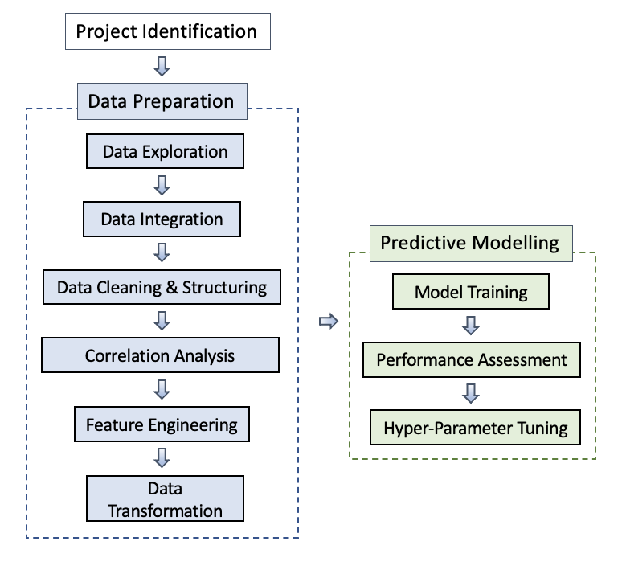
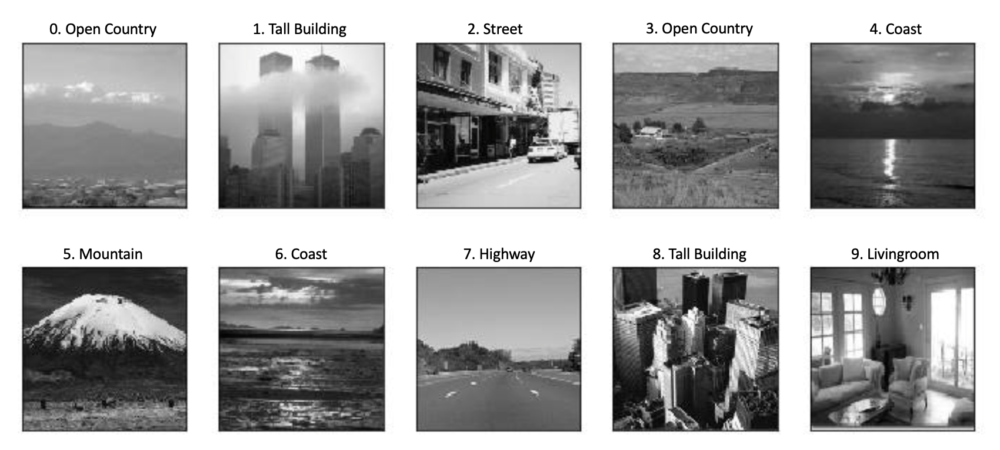

# Project Portfolio

This portfolio includes three  projects:  

* Pokémon Tracker
* Scene Image Classification
* Credit Card Fraud Detection

The implementation of each project underlies the
 as following: 

In the following section, the description and the performance result of each project would be introduced to demonstrate my hands-on experience in Artificial Intelligence.

## Pokémon Tracker
The objective of this project is to design a predictive model using Deep Neural Network (DNN) to predict 6 types of Pokémon based on a list of 16 informative variables. The classification of the Pokémon are classified as following:

- Class 0: [Sandshrew](https://bulbapedia.bulbagarden.net/wiki/Sandshrew_(Pokémon))
- Class 1: [Tentacool](https://bulbapedia.bulbagarden.net/wiki/Tentacool_(Pokémon))
- Class 2: [Slowpoke](https://bulbapedia.bulbagarden.net/wiki/Slowpoke_(Pokémon))
- Class 3: [Magnemite](https://bulbapedia.bulbagarden.net/wiki/Magnemite_(Pokémon))
- Class 4: [Voltorb](https://bulbapedia.bulbagarden.net/wiki/Voltorb_(Pokémon))
- Class 5: [Exeggcute](https://bulbapedia.bulbagarden.net/wiki/Exeggcute_(Pokémon))

The variables from the dataset includes:

- Time appeared 
- Appeared Hour/Minute
- Terrain type
- Water distance
- City appeared
- Continent
- Weather
- Temperature
- Wind speed
- Pressure
- Weather Icon
- Population density
- Urban/ Rural
- Gym distance
- Gym in 100 m
- Co-occurrence

As shown in the line chart below, the predictive model is trained and tested to held balance between being overfitting and underfitting, and loss and accuracy are assigned as evaluation metric to conduct validation assessment. The loss presented in the upper figure indicates the model performance in each iteration of optimisation, the result implies the descending errors made throughout the model learning process. On the other hand, the degree of accuracy suggests the predictive capability of the model parameter.

Further detail of the algorithmn for this project could be assessed through the file `Pokémon Tracker.ipynb`.

## Scene Image Classification
The design of the project is to develop a Convolutional Neural Network (CNN) while utilising data agumentation within the data preparation process. In this project, Xception algorithm is adopted in the image dectection model to achieve high accuracy performance for image classification. The classification of the dataset is targeted at 15 types scene images. The example of the target dataset could be seen as following:

The performance of image detection is illustrated from the graph below: 

Further detail of the algorithmn for this project could be assessed through the file `Scene Image Classification.ipynb`.

## Credit Card Fraud Detection
This project is took part in [2019 T-Brain Machine Learning Competition](https://tbrain.trendmicro.com.tw/Competitions/Details/10) held by E.SUN Commercial Bank. The purpose of the competition is to prevent fraudulent transactions with Machine Learning. 

In this project, XGBoost algorithm is adopted to achieve the project objective. The measurement for prediction model performance is weighed by F1 Score, which explains the harmonic mean of the precision and recall. The result of the F1 Score is presetned as below:

Further detail of the algorithmn for this project could be assessed through the file `Credit Card Fraud Detection.ipynb`.

